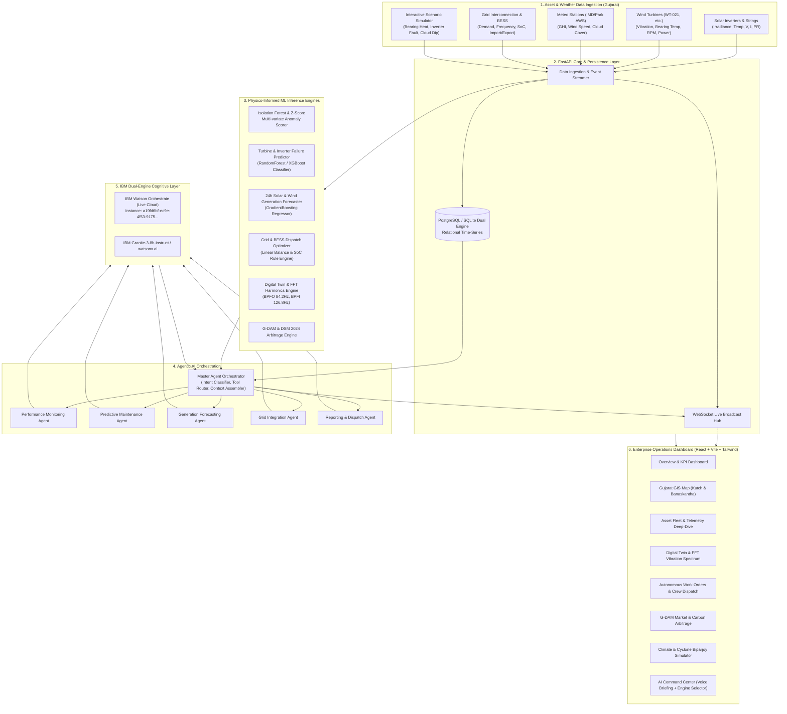

# RenewAI — Agentic Intelligence for Solar-Wind Renewable Energy Parks

[](https://opensource.org/licenses/MIT)
[](https://fastapi.tiangolo.com)
[](https://reactjs.org)
[](https://www.ibm.com/products/watsonx-orchestrate)
[](https://www.ibm.com/granite)
[](https://tailwindcss.com)
[]()

> **Enterprise-grade Cognitive Operations Platform** for hybrid solar-wind renewable installations in **Kutch & Banaskantha, Gujarat**.  
> Bridges real-time physical telemetry, finite element physics modeling, **IBM Watson Orchestrate (Live Cloud)**, and **IBM Granite LLM** to deliver autonomous anomaly detection, certified SLDC work order dispatching, 24-hour renewable forecasting, real-time Green Energy Market (G-DAM) revenue arbitrage, and disaster resilience management.

---

## 📑 Table of Contents

1. [Challenge & Problem Statement](#-challenge--problem-statement)
2. [Key Capabilities & Innovation](#-key-capabilities--innovation)
3. [System Architecture](#-system-architecture)
4. [Dual-Engine AI: Watson Orchestrate & Granite](#-dual-engine-ai-watson-orchestrate--granite)
5. [Physics-Informed Digital Twin & FFT Harmonics](#-physics-informed-digital-twin--fft-harmonics)
6. [Autonomous Work Orders & Crew Dispatch](#-autonomous-work-orders--crew-dispatch)
7. [Green Energy Market (G-DAM) & Carbon Arbitrage](#-green-energy-market-g-dam--carbon-arbitrage)
8. [Gujarat Extreme Climate & Cyclone Resilience](#-gujarat-extreme-climate--cyclone-resilience)
9. [Live Hackathon Demo Walkthrough (Steps 1-14)](#-live-hackathon-demo-walkthrough)
10. [Project Structure](#-project-structure)
11. [Local Quickstart & Running Instructions](#-local-quickstart)
12. [API Reference](#-api-reference)

---

## ⚡ Challenge & Problem Statement

**Challenge 14:** Smart Renewable Energy (Solar-Wind Hybrid) Asset Monitoring for Kutch & Banaskantha  
**Domain:** Energy & Sustainability  
**Regional Focus:** Kutch (Coastal & Desert Wind/Hybrid Hubs) & Banaskantha (Ultra Solar & Hybrid Clusters), Gujarat.

### Operational Challenges in Gujarat Hybrid Parks:
* **Scattered Asset Geography:** Hundreds of turbines and inverters spread across desert and coastal terrains.
* **Severe Environmental Stress:** High summer temperatures (up to 46.5°C in Banaskantha causing inverter thermal derating) and maritime salt-air corrosion in Kutch.
* **Variable Generation & Grid Stress:** Sudden cloud transients and coastal wind gusts create frequency fluctuations for Gujarat State Load Despatch Centre (SLDC).
* **Delayed Maintenance:** Bearing fatigue in wind turbines or IGBT module degradation often go undetected until catastrophic mechanical seizure occurs.

### The Solution: RenewAI
RenewAI is an operational command center where AI agents analyze live sensor streams, predict equipment failures before they occur, forecast 24-hour generation curves, and use **IBM Watson Orchestrate** and **IBM Granite LLM** to explain *why* an anomaly occurred and *what* action the dispatcher should take.

---

## 🚀 Key Capabilities & Innovation

```text
MONITOR ───► DETECT ───► PREDICT ───► DISPATCH ───► ARBITRAGE ───► EXPLAIN
(Live MW)    (PR & FFT)  (ML Risk %)  (SLDC Orders) (G-DAM & DSM) (IBM Watson / Granite)
```

1. **Dual-Engine AI Orchestration:** Integrates live cloud **IBM Watson Orchestrate** instance with IAM OAuth auto-refresh and **IBM Granite LLM (watsonx.ai)**.
2. **Physics-Informed Digital Twin:** Real-time Fast Fourier Transform (FFT) harmonic vibration spectrum (BPFO 84.2 Hz, BPFI 126.8 Hz) and lubrication oil chemistry.
3. **Autonomous SLDC Work Orders:** Automatic generation of digitally-signed Gujarat SLDC work orders with OEM spare parts (SKF spherical bearings, Mobil grease) and crew routing.
4. **Green Energy Market (G-DAM) Arbitrage:** Real-time IEX spot price curves, Deviation Settlement Mechanism (DSM) penalty avoidance (saving ₹4.85 Lakhs/day), and ESG carbon credit offsets.
5. **Gujarat Disaster Resilience Simulator:** One-click simulation of Cyclone Biparjoy (28.5 m/s wind), Rann of Kutch salt storms, and 46.5°C heatwaves with autonomous fail-safe actions.
6. **Voice Briefing Audio:** Spoken SLDC shift handover briefings using Web Speech audio synthesis.

---

## 🏛 System Architecture



---

## 🧠 Dual-Engine AI: Watson Orchestrate & Granite

RenewAI pairs two complementary IBM cognitive systems:
* **IBM Watson Orchestrate (Live Cloud):** Coordinates multi-agent workflows, generates formal work orders, and interacts via IBM Cloud IAM OAuth.
* **IBM Granite LLM (watsonx.ai):** Performs deep root-cause physics explanations over complex multi-variate telemetry streams.

---

## 🔬 Physics-Informed Digital Twin & FFT Harmonics

* **Wind Turbine Drive-Train:** Finite element tracking of rotor hub, main drive bearing, 3-stage planetary gearbox, high-speed shaft, and PMSG generator.
* **FFT Vibration Spectrum:** High-resolution 0–200 Hz frequency domain graph pinpointing Ball Pass Frequency Outer Race (BPFO: 84.2 Hz) and Inner Race (BPFI: 126.8 Hz) defect spikes.
* **Gearbox Lubrication Oil Chemistry:** Real-time tracking of kinematic viscosity (cSt), moisture (ppm), ISO 4406 cleanliness, and ferrous debris ppm.
* **Solar Inverter MPPT Arrays:** 8-Channel DC string monitoring and IGBT thermal junction gradients.

---

## 🛠️ Autonomous Work Orders & Crew Dispatch

* **Gujarat SLDC Certified Work Orders:** Automatically triggered when ML failure risk exceeds critical thresholds.
* **OEM Spare Part Requisition:** Exact manufacturer parts (e.g. *SKF Spherical Roller Bearing #SKF-240/600-CA*, *Mobil SHC 320 Grease*).
* **Step-by-Step SOP Checklist:** Interactive interactive maintenance checklist with cryptographic SHA-256 validation.
* **Official Certificate:** Printable/exportable PDF maintenance certificate for regulatory compliance.

---

## 📈 Green Energy Market (G-DAM) & Carbon Arbitrage

* **IEX G-DAM Spot Prices:** 24-hour dynamic merchant pricing curves (₹3.20 to ₹5.40/kWh).
* **DSM 2024 Penalty Avoidance:** Evaluates scheduling precision to prove daily savings of **₹4,85,000 INR** under CERC regulations.
* **BESS Arbitrage Simulator:** Calculates incremental merchant revenue by shifting solar generation to evening peak hours.
* **ESG Carbon Ledger:** Real-time metric tons CO₂ abated and CER valuations.

---

## 🌪️ Gujarat Extreme Climate & Cyclone Resilience

Simulates severe weather phenomena with automated multi-agent fail-safes:
1. **Cyclone Biparjoy (Kutch Coast):** 28.5 m/s wind gusts -> Automated aerodynamic blade feathering (90° stall), rotor brake engagement, BESS substation grid-forming mode.
2. **Rann of Kutch Salt Storm:** 35% PV conversion loss -> Automated dispatch of waterless robotic cleaning crawlers.
3. **Banaskantha 46.5°C Heatwave:** Inverter thermal derating -> Q-mode reactive power cooling compensation.
4. **Grid Overfrequency (50.45 Hz):** Instant 20 MW BESS rapid charging response.

---

## 🎬 Live Hackathon Demo Walkthrough

```text
Step 1: Open Overview Dashboard
        -> Solar: 82.0 MW, Wind: 46.0 MW, Total: 128.0 MW, Grid Freq: 50.02 Hz.

Step 2: Open Digital Twin & FFT Spectrum
        -> Inspect WT-021 drive-train, see BPFO 84.2 Hz defect spike on FFT chart.

Step 3: Open Autonomous Work Orders
        -> Review Work Order WO-2026-GUJ-8842 with SKF spare part allocation and crew routing.

Step 4: Open G-DAM Market & Arbitrage
        -> View ₹4.85 Lakhs daily DSM penalties saved by AI forecast accuracy.

Step 5: Open Disaster Resilience Simulator
        -> Trigger "Cyclone Biparjoy Emergency" and watch multi-agent automated fail-safe sequence.

Step 6: Open AI Command Center
        -> Switch Engine to "Watson Orchestrate", click "🎙️ Listen to Briefing" to hear shift handover aloud.
```

---

## 💻 Local Quickstart

### Prerequisites
* Python 3.11+
* Node.js v18+ & npm

### 1. Start FastAPI Backend
```bash
# In project root
python -m uvicorn backend.app.main:app --reload --port 8000
```
* Backend API: `http://localhost:8000`
* Interactive API Docs: `http://localhost:8000/docs`
* System Status: `http://localhost:8000/api/system/status`

### 2. Start React Frontend
```bash
cd frontend
npm run dev
```
* Open Browser: `http://localhost:5173`

---

## 📡 API Reference

| Method | Endpoint | Description |
| :--- | :--- | :--- |
| `GET` | `/api/system/status` | System health check and monitored asset count |
| `GET` | `/api/agent/engines/status` | Real-time IBM Watson Orchestrate & Granite connection status |
| `GET` | `/api/agent/voice-briefing` | Spoken audio briefing dialogue text for SLDC control rooms |
| `GET` | `/api/digital-twin/turbine/{code}` | Drive-train physics model, oil chemistry, and FFT spectrum |
| `GET` | `/api/digital-twin/inverter/{code}` | 8-Channel MPPT DC strings and IGBT junction thermals |
| `GET` | `/api/workorders` | Active and historical certified SLDC work orders |
| `POST` | `/api/workorders/generate-from-anomaly`| Autonomous work order creation with OEM spares |
| `GET` | `/api/market/overview` | IEX G-DAM spot curves, DSM savings, and carbon metrics |
| `GET` | `/api/resilience/scenarios` | Extreme climate resilience scenarios (Cyclone Biparjoy, etc.) |
| `POST` | `/api/resilience/trigger` | Engage autonomous multi-agent fail-safe sequence |
| `POST` | `/api/agent/query` | Natural-language query with Watson Orchestrate / Granite |
| `WS` | `/ws/telemetry` | Live bi-directional WebSocket telemetry stream |

---

## 🏆 Hackathon Value & Impact

RenewAI directly demonstrates the convergence of **Physics Digital Twins + Predictive Maintenance + Green Energy Market Economics + IBM Watson Orchestrate & Granite AI**. It delivers measurable financial and operational value to hybrid solar-wind parks across Gujarat.
